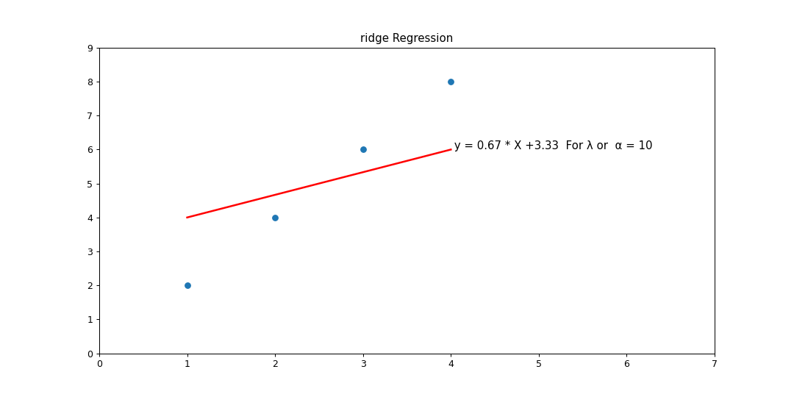

# Ridge Regression Script

This Python script demonstrates the implementation of Ridge Regression using the `sklearn` library. Ridge Regression is a regularization technique that helps mitigate the issue of overfitting in machine learning models by adding a penalty (regularization term) to the loss function. This script provides a simple example of how Ridge Regression can be applied to a dataset.

## Output

The script generates a plot showing the Ridge Regression fit. The plot will display:

- `The predicted line of best fit.`
- `The scatter plot of the original data.`
- `The equation of the Ridge regression line with the calculated coefficients and intercept.`

## Key Concepts

- Overfitting: `A scenario where the model learns not only the underlying pattern but also the noise in the data, leading to poor performance on unseen data.`

- Underfitting: `Occurs when the model is too simple to capture the underlying pattern in the data, leading to poor performance on both the training and unseen data.`

- Ridge Regression: `A type of linear regression that includes a regularization term (L2 penalty) to prevent overfitting by shrinking the regression coefficients.`

- Lasso Regression: `Similar to Ridge Regression but uses an L1 penalty, which can set some coefficients to zero, effectively selecting features.`

## Output Graph

Ridge Regression